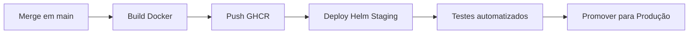

# Runbook: Pipeline CI/CD

## Workflows

| Workflow | Gatilho | Quality Gates |
|----------|---------|--------------|
| `backend-ci.yml` | Push/PR em `web/`, `config/`, `recipes/` | PHPStan level 8, PHPCS, Snyk, PHPUnit ≥80%, Spectral |
| `frontend-ci.yml` | Push/PR em `frontend/` | ESLint, Prettier, tsc, Jest ≥80%, Lighthouse CI, axe-core |
| `test.yml` | Push/PR em `main`/`develop` | DDEV smoke test |
| `editorconfig.yml` | Push/PR | Validação EditorConfig |
| `code-style.yml` | Push/PR | Verificação de estilo |

## Quality Gates Bloqueantes

| Gate | Workflow | Comando | Threshold |
|------|----------|---------|-----------|
| PHPStan | backend-ci | `phpstan analyse --level=8` | Nível 8, zero erros |
| PHPCS | backend-ci | `phpcs --standard=Drupal` | Drupal standard |
| Snyk | backend-ci | `snyk test --severity-threshold=high` | Zero critical/high |
| PHPUnit Coverage | backend-ci | `phpunit --coverage-clover` | ≥80% |
| Spectral | backend-ci | `spectral lint` | Zero erros |
| ESLint | frontend-ci | `npm run lint` | Zero erros |
| Prettier | frontend-ci | `prettier --check` | Zero diferenças |
| TypeScript | frontend-ci | `tsc --noEmit` | Zero erros |
| Jest Coverage | frontend-ci | `jest --coverage` | ≥80% |
| Lighthouse | frontend-ci | `lhci autorun` | Score ≥90 |
| Accessibility | frontend-ci | `axe-core` | Zero violações |

## Deploy

### Backend (Helm)

### Frontend (Vercel)

## Troubleshooting

| Problema | Causa | Solução |
|----------|-------|---------|
| Pipeline falhou | Quality gate não passou | Verificar logs no GitHub Actions |
| Coverage abaixo | Testes insuficientes | Adicionar testes e rodar novamente |
| Snyk encontrou vuln | Dependência vulnerável | Atualizar dependência ou adicionar `.snyk` ignore |
| Docker build lento | Cache miss | Verificar cache GHCR |
| Helm deploy falhou | Valores inválidos | Validar com `helm template` |

## Referências

- [Workflows](file:///home/dionata/projects/local/archTech-suite/.github/workflows/)
- [Helm Chart](file:///home/dionata/projects/local/archTech-suite/infrastructure/kubernetes/helm/)
